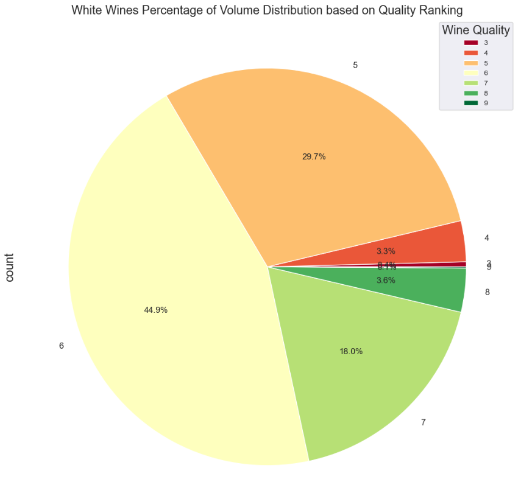

# **Wine Quality Analysis**

## Introduction
A wine quality dataset was used to provide the framework for our assignment. The dataset contains information about red and white Vinho Verde wine samples from Northern Portugal. The data models the quality of wine based on physiochemical tests.

Our focus for this assignment was to take the fundamental elements provided within the dataset and present it to our audience as if we were a winemakers. Collectively, we researched which factors contribute to high-quality wine and created visualizations based on our findings. Understanding these factors provided our group with some of the basic knowledge required to sell high-quality wine.

## Factors Analyzed
The following are the factors that we focused on: fixed acidity, volatile acidity, citric acid, sulphates, chlorides, residual sugar, pH, and alcohol.

We focused on the acidity contents of wine, since acids contribute to the overall taste. The acidity of the wine has a direct correlation with pH, stability and colour. 

### Fixed Acidity
Refers to tartaric acid, the primary acid in wine. It contributes to the wine's sourness and is influenced by the climate and soil content where the grapes are grown. Higher fixed acidity levels help maintain a wine’s freshness and structural integrity.

### Volatile Acidity
Measures gaseous acids impacting taste, spoilage, and aroma of the wine. High levels of volatile acid can lead to vinegar-like flavors and aromas. The high levels of volatile acidity are from unhealthy grapes, poor winery hygiene and oxidative processes. Thus, there is a negative correlation between the values.

### Citric Acid
Adds freshness and flavour complexity. Citric acid is derived from wine grapes and can be produced in the fermentation process. Highter citric acid levels are positively associated with higher wine quality ratings.

### Sulphates
Sulphates act as antimicrobials and antioxidants. They help in preserving the wine by preventing oxidation and spoilage, which are critical for maintaining the wine's quality over time​. Higher sulphate levels are often associated with better quality wine.

### Chlorides
Primarily come from the soil and water used in vineyards, as well as from any salt-based treatments used in the winemaking processes.​ In high-quality wines, chloride levels are low to balance taste.

### Residual Sugar
Residual sugar is from the natural occurring sugars after the fermentation process. The less sugar, the drier the wine. In white wines, the sugar content decreases with the quality of wine. While in red wines, the sugar level stays consistent regardless of the quality. This residual sugar is measured in grams per litre (g/L). Dry wines have less sugar, and are generally better quality over the cheaper wines, which are very high in sugar content. However, the sugar content can also vary based on the type of wine. For example, a high-quality White Zinfandel (7.5g/litre) will have more residual sugar, compared to that of a Sauvignon Blanc which is categorized as a Dry Wine with 3.75g/L residual sugar. Unfortunately, in our dataset we were not given information specifically on types of wine present. So, these factors cannot be isolated and explored. Red wines however, the sugar level stays consistent regardless of the quality as seen in the graph. That is because the fermentation process and grapes are different than white wine. While making red wine the whole grape is used, compared to while making white wine, only juice from the grapes is used during the fermentation process. There is also less sugar the longer the wine is fermented. Red wine has two fermentation processes while white has one.

### pH
Grapes make wine acidic. For wine to have the complexity of favours and composition that it does, it must have a pH between 3 and 4. The pH determines the body of the wine, along with the alcohol content, which correlates to the overall quality of wine. In relation to our graphs, the quality of wine is on a scale between 3 to 9. Where 3 is the lowest and 9 is the highest quality.  Red wines have higher acidities and improve with time, while low acidity wines are less stable and more susceptible to microbes. When understanding the body of the wine, red and white wines can be divided into light-bodied, medium-bodied and full-bodied wines. Full-bodied wines are generally depicted as higher quality wines, while light-bodied are lower quality as depicted below. Lower bodied wines have a higher pH and lower alcohol content, while high bodied wines have lower acidity and higher alcohol content.

### Alcohol
Contributes to the wine’s body and overall quality. Higher alcohol content is generally associated with higher quality wines.

## Results and Conclusions
High-quality wines typically exhibit a well-balanced combination of acidity, alcohol, and residual sugar. Fixed acidity and citric acid are crucial for providing structure and freshness, while sulphates and sulfur dioxide help maintain stability and prevent spoilage.

### Future Research
If more time were available, future research could focus on:
- Analyzing the impact of different grape varieties on wine quality.
- Explore how different climates around the world impact the fixed acidity in wine.
- Investigating the effects of aging on various wine attributes.
- Explore the physiochemical makeup of specifice types of wines, for example; White Zinfandel, Sauvignon Blanc, Cabernet Sauvignon, and Pinot Noir.

## References
1. UCI Machine Learning Repository. (2009). Wine Quality Dataset. Retrieved from [UCI Machine Learning Repository](https://archive.ics.uci.edu/ml/datasets/Wine+Quality).
2. Wine Folly. (n.d.). Wine Acidity: The Science and Magic. Retrieved from [Wine Folly](https://winefolly.com/tutorial/wine-acidity/).
3. Waterhouse Lab. (n.d.). Fixed Acidity in Wine. Retrieved from [Waterhouse Lab](https://waterhouse.ucdavis.edu/whats-in-wine/fixed-acidity).
4. Wine Spectator. (n.d.). Residual Sugar in Wine. Retrieved from [Wine Spectator](https://www.winespectator.com/articles/residual-sugar-in-wine).
5. Wine Enthusiast. (n.d.). Understanding Wine Sweetness. Retrieved from [Wine Enthusiast](https://www.winemag.com/2018/05/16/wine-sweetness-chart/).
6. WineMakerMag. (n.d.). The Role of Sulphites in Wine. Retrieved from [WineMakerMag](https://winemakermag.com/article/858-the-role-of-sulfites-in-wine).
7. SpringerLink. (2009). Using Data Mining for Wine Quality Assessment. Retrieved from [SpringerLink](https://link.springer.com/chapter/10.1007/978-1-84800-370-3_16).
8. RStudio Pubs. (n.d.). Quantifying Quality of Red Wine: The Predictive Powers of pH and Sulphate Content. Retrieved from [RStudio Pubs](https://rpubs.com/).
